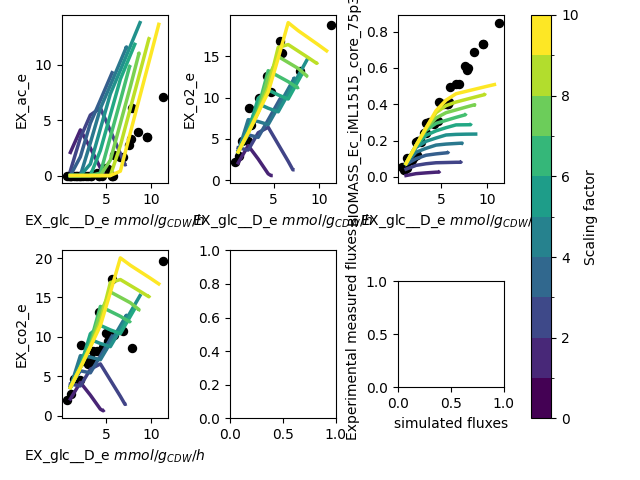

# Protein Sector Initialization
Before the parametrization can start, we first should define the enzyme sectors. The PAM consists out of three
coarse-grained enzyme sectors, which can be derived from various sources:

- **Translational Protein Sector**: represents the proteome fraction allocated to translational proteins, e.g. ribosomes
  - Data from: quantitative proteomics data, assume relation is similar to *E. coli*
  - Script: `0_translational_sector_config.ipynb`
  - Correlated with substrate uptake rate
  - Optimized during parametrization: NO
    - might be changed for different substrates during optimization
- **Unused Enzyme Sector**: represents the proteome fraction of metabolic proteins which are not (fully used), e.g. under/unused enzymes
  - Data from: protein overexpression experiments and the growth rate after Adaptive Laboratory Evolution
  - Script: `0_unused_enzyme_determination.ipynb` (initialization), `2_scan_maxgrowthrate_UE.py` (optimization)
  - Correlated with growth rate
  - Optimized during parametrization: NO
    - The growth rate at which there are no unused enzymes anymore ('*true*' maximal growth rate) can be optimized during preprocessing
- **Active Enzyme Sector**: consists out of all enzymes associated with metabolic reactions. 
  - Data from: GotEnzymes
  - Scripts: `0_parse_kcat_values_GotEnzymes.ipynb` (initialization) and `1_scale_kcats_AES.py` (optimization)
  - Optimized during parametrization: YES
    - The mean kcat from GotEnzymes is often low and can be optimized during preprocessing

## What do you need to initialize the protein sectors
The scripts listed above require some input from the user. Below we provide the data you need to provide in which format

### Step 0: setting up the initial parameters (*Required*)
- `0_parse_kcat_values_GotEnzymes.ipynb`
  - sbml or json file with your model
  - The model should contain gene-protein-reaction rules
  - Regular expression to find locustags (needed to parse the gene-protein-reaction rules)
  - All files which need to be downloaded are described in the script (flat files of UniProt, GotEnzymes, RHEA and MetaNetX)
  - Please skip the last cell if you do not have information on the other protein sectors yet
- `0_translational_sector_config.ipynb`
  - Optional: quantitative proteomics dataset with functional annotation (tabular format, like .csv or .xlsx)
    - Please adjust the first two cells to the format of your dataset
  - Optional: information about growth rate at which microbe enters 'overflow like' metabolism (if applicable) (float)
  - IF optional information is not provided, information from *E. coli* will be used
  - sbml or json file with your model
  - Information about the configuration of your model, such as substrate uptake rate id, biomass reaction id, etc. More details can be found in the [PAModelpy documentation](https://github.com/iAMB-RWTH-Aachen/PAModelpy/blob/main/docs/docs/example.md). 
    - Please be aware that these should be changed in the script!
- `0_unused_enzyme_determination.ipynb`
  - This is an example of how it is derived for *E. coli*
    - Intercept: level of protein overexpression (eGFP) at which growth rate is 0 h-1
    - Slope: intercept/max_growth_rate, where the max_growth_rate is the maximal growth rate of a wildtype strain after adaptive laboratory evolution (ALE) on glucose minimal medium
    - If ALE experiments are not available, the slope can either be derived by increasing the maximal growth rate of a wildtype strain with 61.4% or using `2_scan_maxgrowthrate_UE.py`
    - 61.4%: increase in growth rate in *E. coli* after ALE using 0.7 as max growth rate and ln(1.63 doublings per hour) as max ALEd growth rate ([Lenski. 2017](https://www.nature.com/articles/ismej201769))
  - In the `Yeast9` folder, an example of the derivation of the unused enzyme sector from protein overexpression experiments is given

Together, these steps will generate an excel file 'proteinAllocationModel_{modelname}_EnzymeticData_{yymmdd}.xlsx' which is 
stored in the `Data` folder.

### Step 1. Scale the kcat values (*Optional but recommended*)
`1_scale_kcats_AES.py`

Very often, the predicted kcats are too low, which results in long computational times to find the optimum, or not finding
an optimum within reasonable time. Therefore, we can scale the kcat values to provide a better starting point for optimization.
This script runs simulations with different scaling factors, which scale the kcat values. The result can be used to find 
the best kcat set to start optimization with.

- **Required input**: 
  - function to set up the protein allocation model with previously defined parameters (see [PAModelpy documentation](https://github.com/iAMB-RWTH-Aachen/PAModelpy/blob/main/docs/docs/example.md))
  - function to set up the PAM parametrizer (this includes experimental data for validation) (see [the documentation](../../docs/PAM_param.md) and `Scripts/Testing/pam_parametrizer_iML1515.py`)
  - file path to save the figure which can be used for validation
  - substrate uptake rate id for the model under study

- **Optional inputs**:
  - range of scaling factor, including stepsize
  - range of substrate uptake rates to scan

- **Estimated run time**: 5-15 minutes

- **Output**:
  - figure comparing simulations using kcats with different scaling factors
  - the user can use the output figure to define the best scaling factor for the kcat values

Example of an output figure:

### Step 2. Find the 'true' maximal growth rate for the unused enzymes sector (*Optional*)
`2_scan_maxgrowthrate_UE.py`

When microbes grow at their maximal growth rate, they do not use all their protein resources to the fullest. In this way,
there are always some proteins to quickly change metabolism to different conditions. This makes the parametrization of 
the unused enzyme sector a bit more complicated: we cannot assume the protein fraction allocated to the unused enzyme sector
to be zero at the observed maximal growth rate. This information is required to determine the relation between the growth rate 
and the unused enzyme sector. But how do we know at which growth rate the microbe uses all its protein resources? We can 
assume that after the microbe is adapted to a non-changing environment, such as during an Adaptive Laboratory Evolution (ALE)
experiment, it uses all its protein resources optimally. This means that we can use the final growth rate of a strain which underwent
ALE in batch minimal medium to parametrize the unused enzyme sector. However, we commonly do not have access to ALEd
strains. We can also use the PAMparametrizer to get an estimate of what the 'true' maximal growth rate might be.

We achieve this by running several iterations of the PAMparametrizer with different 'maximal' growth rates to parametrize
the unused enzyme sector. We can then compare the results and determine which 'maximal' growth rate results in the best
fit for the parametrization.

- **Required input**:
  - function to set up the PAM parametrizer (this includes experimental data for validation) (see [the documentation](../../docs/PAM_param.md) and `Scripts/Testing/pam_parametrizer_iML1515.py`)
  - list of potential maximum growth rates to scan
  - kcat_increase factor as obtained from `1_scale_kcats_AES.py` (replace with 1 if this step was skipped)
  - UE_0: level of protein overexpression (eGFP) (as fraction of total protein) at which growth rate is 0 h-1
  - file path to save the dataframe (.xlsx) with resulting r squared values
  - substrate uptake rate id for the model under study

- **Optional input**:
  - range of substrate uptake rates to scan
  - number of duplicate parametrization (more duplicates -> more simulation time)
  - PAMparametrizer hyperparameters (number of processes, number of iterations, etc)

- **Estimated run time**: (default hyperparameters)
  - Strongly depends on the hyperparameters and model size!

- **Output**:
  - Excel with r-squared values for each parametrization (by default: 3 r-squared values per parameter set)
  - mean r_squared values can be used to determine the best 'true' maximal growth rate