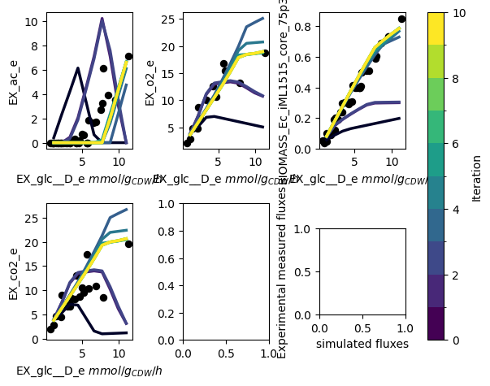
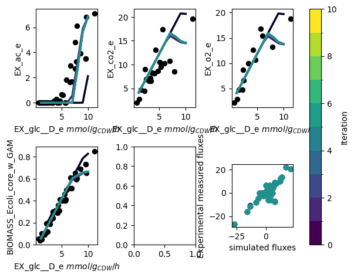

# Example usage of the PAMparametrizer

## Example 1: Parametrizing the *E. coli* Protein Allocation Model with glucose as sole carbon source
In the first tutorial, we walk over the steps how to set up, run and analyze the result of the PAMparametrizer for the
well studied example of *Escherichia coli*. In case you want to adjust this tutorial to your microbe of study, please
refer to the [PAModelpy documentation](https://iamb-rwth-aachen.github.io/PAModelpy/example) on how to set up the 
PAM for another microbe.

For this entire tutorial, you'll need to load the following packages:

```python
import os
import pandas as pd
# you want to filter out the warnings to ignore all the times the parametrizer hits infeasibilities, which is pretty annoying
import warnings
warnings.filterwarnings("ignore")

#cobra toolbox
import cobra

#PAModelpy toolbox
from PAModelpy.configuration import Config
from PAModelpy.utils import set_up_pam, parse_reaction2protein


#this repo
from Modules.PAM_parametrizer import ValidationData, HyperParameters, ParametrizationResults
from Modules.PAM_parametrizer import PAMParametrizer
from Modules.utils.pamparametrizer_setup import set_up_sector_config

```

### Step 0: Initiate the parameter set using GotEnzymes
We first need to get our initial parameter set. For this, we use the reactions and proteins which are available in the model,
uniprot and GotEnzymes. In order to parse everything properly, we need to juggle the identifiers of the proteins and reactions.
Please refer to `Scripts/i1_preprocessing/0_parse_kcat_values_GotEnzymes.ipynb` for an example notebook on how to do this.

### Step 1: Organize the data
The parametrizer needs data to validate the model with. This data is stored in Excel files and should be parsed in a format
which matches the valid_data attribute in the ValidationData object. In the `Data/Ecoli_phenotypes/Ecoli_phenotypes_py_rev.xls`
file there are measurements of different exchange rates from different experiments and studies.

If you want to use this example for your microbe, or adapt any off the set-up scripts available in the `Scripts/i2_parametrization`
folder, we advise you to parse your exchange rates in the following format:

| \<Biomass reaction id\> | \<substrate uptake id\>           | \<other exchane reaction id\>     |
|-------------------------|-----------------------------------|-----------------------------------|
| ....                    | Check the direction in the model! | Check the direction in the model! |


### Step 2: Build the Protein Allocation Model
With all the data in place, we are ready to build some models. We start building the Protein Allocation Model (PAM) with 
the parameters we have gathered in step 0. For completeness, we will describe here shortly how the PAM is initiated using 
the setup utilities from [PAModelpy](https://github.com/iAMB-RWTH-Aachen/PAModelpy). As an input, we need to provide
an Excel file with the GPRAs and initial kcat values to create dictionaries which contain the mapping of the reactions 
to proteins to genes, and the path to the SBML model. For more details, please refer to the 
[PAModelpy documentation](https://pamodelpy.readthedocs.io/en/latest/PAM_setup_guide.html). 


```python
#make sure the model gets the right IDs. Adjust the Config object for your microbe as needed
config = Config()
config.reset()

pam = set_up_pam(os.path.join('Results','1_preprocessing', 'proteinAllocationModel_iML1515_EnzymaticData_250423.xlsx'),
                 os.path.join('Models', 'iML1515.xml'), 
                 configuration = config)
```

If for your microbe this information is not available, you can use the *E. coli* parameters. In the PAMparametrizer,
the relation between the substrate uptake rate and translational protein sector will be automatically parametrized if 
you do not provide a set of parameters when initializing the PAMparametrizer.

### Step 3: Create the data objects required for the PAMparametrizer
After initiating the model, we need to define the required phenotype (e.g. experimental data) and some hyperparameters
to steer the behaviour of the genetic algorithm. To set up the PAMparametrizer, we thus need to define some data objects
holding this information. When running the PAMparametrizer, the results are saved in some additional data objects.
You do not need to provide the latter object when initiating the PAMparametrizer, but we discuss them and their use here 
for sake of completeness. For a more detailed description of the data objects and their function, please refer to the 
[introduction of the PAMparametrizer](./PAM_param.md)

#### i. Parse the sector configuration
The sector configuration helps the PAMparametrizer translate parameters which are related to the substrate uptake rate
to different substrates. Did you use the setup methods in the preprocessing toolbox? Then this step is really easy:

```python
sector_configs = set_up_sector_config(
    pam_info_file = os.path.join('Results','1_preprocessing', 'proteinAllocationModel_iML1515_EnzymaticData_250423.xlsx'),
    sectors_not_related_to_growth = ['UnusedEnzymeSector', 'TranslationalProteinSector']
)
```

#### ii. Get the ValidationData
The ValidationData object stores experimental information about a single condition, which can be used to validate the model
with. In Step 1 you have stored your experimental data in such a way, that it is easy to use by the PAMparametrizer. Now
we will do the final steps to be able to feed the information to the PAMparametrizer. As we are only parametrizing on
a single carbon source, we only need a single ValidationData object.

First, we will define some defaults: w<e want to parametrize the model only on a specific range of glucose uptake rates
(between 0.1 and 10 mmol/g<sub>CDW</sub>/h) and we want to use the exchange rates of acetate, CO<sub>2</sub>, and 
O<sub>2</sub>, and the growth rate for validation.

```python

MAX_SUBSTRATE_UPTAKE_RATE = -0.1
MIN_SUBSTRATE_UPTAKE_RATE = -10
RXNS_TO_VALIDATE = [config.ACETATE_EXCRETION_RXNID,  config.OXYGEN_UPTAKE_RXNID, config.BIOMASS_REACTION, config.CO2_EXHANGE_RXNID]
VALID_FILE_PATH = os.path.join('Data', 'Ecoli_phenotypes', 'Ecoli_phenotypes_py_rev.xls')
```
Next, we load our exchange rates in a dataframe. We need to define the actual substrate uptake rate separately, to easily
compare this dataframe with the simulated data later on (the simulated substrate uptake rate does not necessarily reach
its upperbound).

```python
valid_data_df = pd.read_excel(VALID_FILE_PATH, sheet_name='Yields')
#use the suffix '_ub' to create a column used to set the lowerbound of the substrate uptake rate
valid_data_df = valid_data_df.rename(columns={config.GLUCOSE_EXCHANGE_RXNID: config.GLUCOSE_EXCHANGE_RXNID + '_ub'})
#build the validation data object
validation_data = ValidationData(valid_data_df, config.GLUCOSE_EXCHANGE_RXNID, [MIN_SUBSTRATE_UPTAKE_RATE, MAX_SUBSTRATE_UPTAKE_RATE])

#define the reactions used to validate and plot. By default, both are set to all the reactions in the columns of valid_data_df
validation_data._reactions_to_plot = RXNS_TO_VALIDATE
validation_data._reactions_to_validate = RXNS_TO_VALIDATE
```

In the case of glucose-limited growth in *E. coli* we actually know the relation between substrate uptake and the 
translational/unused enzymes sector. We can provide this information to the ValidationData object. If we do not provide this information,
it will be determined automatically using the relation for *E. coli* as a default.

```python
validation_data.sector_configs = {
                'TranslationalProteinSector':{
                'slope': pam.sectors.get_by_id('TranslationalProteinSector').tps_mu[0],
                'intercept': pam.sectors.get_by_id('TranslationalProteinSector').tps_0[0]
            },
                'UnusedEnzymeSector': {
                    'slope': pam.sectors.get_by_id('UnusedEnzymeSector').ups_mu,
                    'intercept': pam.sectors.get_by_id('UnusedEnzymeSector').ups_0[0]
                }}
```

#### iii. Define the HyperParameters
The HyperParameters object can be used to change the behaviour of the PAMparametrizer and the genetic algorithm. In both
cases, there are a lot of settings which can be adjusted. Most of these settings can be left at their defaults. Here, we 
only change the name of the output and the duration of the parametrization, such that you can run this example easily on 
a laptop.

```python
hyperparams = HyperParameters

#PAMparametrizer hyperparameters
hyperparams.threshold_iteration = 3
hyperparams.number_of_kcats_to_mutate = 5
hyperparams.genetic_algorithm_filename_base = 'genetic_algorithm_run_iML1515_glc_'
hyperparams.filename_extension = '_glc'

#genetic algorithm hyperparameters
hyperparams.genetic_algorithm_hyperparams['processes'] = 2
hyperparams.genetic_algorithm_hyperparams['number_gene_flow_events'] = 2
hyperparams.genetic_algorithm_hyperparams['number_generations'] = 2
hyperparams.genetic_algorithm_hyperparams['print_progress'] = True
```

#### iv. ParametrizationResults and FluxResults
Upon initialization of the PAMparametizer, a ParametrizationResults object will be generated. This will object will be empty
upon generation. However, when the PAMparametrizer starts, it will initiate the attributes of the PAMparametrizer using
the `PAMParametrizer._init_results_objects()` function. This also triggers the generation of one FluxResults object for 
each substrate uptake reaction in `ParametrizationResults.substrate_uptake_ids`. In our case, this will thus result in a 
single FLuxResults object to store the simulation results for the glucose-limited chemostat simulations. 

### Step 4: Build the PAMparametrizer object
Now we have all data objects, models and initial parameters in place, we are finally ready to start building our 
*E. coli* PAMparametrizer (:D)! Please note that, even though we have only a single ValidationData object, we have to 
provide it as a DictList. In this case, as we only have a single condition, providing the `substrate_uptake_id` is obvious.
However, if you have multiple conditions, you have to select the most representative substrate uptake reaction
(with the most data, the most complex metabolic phenotype, etc), as this condition will then be used to visualize the 
progress.

```python
pam_parametrizer = PAMParametrizer(pamodel=pam,
                                   validation_data=cobra.DictList(validation_data),
                                   hyperparameters=hyperparameters,
                                   sector_configs = sector_configs,
                                   substrate_uptake_id=config.GLUCOSE_EXCHANGE_RXNID,
                                   max_substrate_uptake_rate=MAX_SUBSTRATE_UPTAKE_RATE,
                                   min_substrate_uptake_rate=MIN_SUBSTRATE_UPTAKE_RATE)
```

### Step 5: Run!
We finally reached the point where we can run the framework. Depending on your hyperparameters, the performance of your
system, and the size of your model, this can take between 15 and 30 hours. So take this into account when doing this tutorial!

Optionally, you can run the framework on a cluster. In the `Scripts/Shell` directory, there are some example shell scripts
which can be used to run the framework on a cluster with Slurm.

```python
pam_parametrizer.run()
```

The PAMparametrizer now starts running. During the run, some statistics of the generations of the genetic algorithm and
the simulations the parametrizer performs will be printed in the terminal. Furthermore, a plot with the experimental 
measurements (dots) and the simulations (lines) will appear. This allows you to see the progress of the algorithm in an
intuitive way.

This is an example of a progress plot with only glucose as a carbon source:



### Step 6: Analyze the Results
When the the parametrization is finished, you can find 2 files in the `Results` directory:

- `pam_parametrizer_diagnostics_glc.xlsx`
- `pam_parametrizer_progress_glc.png`

The former is the file containing the results of the parametrization. The PAMparametrizer saves the `Best_Individuals`,
`Computation_Time`, `Final_Errors`,`reaction_weights`, and `sector_parameters`. For most users, the `Best_Individuals` and `Final_Errors`
sheets will be most important, as these contain the k<sub>cat</sub> values for each enzyme-reaction relation resulting
from each iteration of the genetic algorithm, and the final error between the simulations and experimental data, respectively.
If you want to create a very pretty plot from these results, please adapt the `Scripts/i3_analysis/PAMparametrizer_progress_cleaned_figure.py`
script to your liking.

You can use both the output figure as the file to determine how happy you are with the parametrization. If you want 
to improve the parametrization, you can increase the number of k<sub>cat</sub>s to mutate, the number of iterations,
the number of generations, the number of gene flow events, or any other hyperparameter which you think is suitable. 
It is important to understand that the genetic algorithm is not a deterministic method. This means that each time you 
run the framework, the result might be different due to chance. It is also possible for the algorithm to get stuck in a 
local minimum. If you think this is happening, you can increase the 'randomness' of the model by increasing the mutation
probability.


----------------------------------------------------------------------------------------------
## Example 2: Parametrizing the *E. coli* Protein Allocation Model with multiple carbon sources
In the previous example, we showed how to set up, run and analyze a PAMparametrizer with on a single carbon source. 
However, we know that microbes can grow on different carbon sources. For many microbes, there are few datapoints for
a single carbon source, but many if you add them all up. Therefore, we will walk through an example which makes use of
multiple carbon sources. In this case we also use intracellular fluxes measured by Metabolic Flux Analysis (MFA).
This is not recommended, as the accuracy of these measurements is low and this strongly affects the parametrization.

### Step 0: Initiate the parameter set
As described in the previous example, you can use `Scripts/i1_preprocessing/0_parse_kcat_values_GotEnzymes.ipynb` script to obtain the initial
set of parameters. 

### Step 1: Organize the data
In addition to the flux data from the `Data/Ecoli_phenotypes/Ecoli_phenotypes_py_rev.xls` Excel file, we also have some
MFA data for *E.coli*, available in `Data/Ecoli_phenotypes/fluxomics_datasets_gerosa.xlsx`. This is 
MFA data from multiple studies gathered by [Gerosa et al. (2015)](https://www.cell.com/cell-systems/abstract/S2405-4712(15)00146-5).
For easy application, we saved this data in so-called *long* format.

| reaction        | condition                                                  | mu              | substrate                 |
|-----------------|------------------------------------------------------------|-----------------|---------------------------|
| \<reaction_id\> | \<condition_id\> (e.g. human readible substrate uptake id) | \<growth rate\> | \<substrate uptake rate\> |


### Step 2: Build the PAM
See the [previous example](#step-2-build-the-protein-allocation-model) on how to build the iML1515 PAM.

### Step 3: Create the data objects required for the PAMparametrizer
#### i. Parse the sector configuration
See the [previous example](#i-parse-the-sector-configuration) on how to build obtain the sector configuration.
#### i. Get the ValidationData
In the previous example you have seen how to build the ValidationData object for a single carbon source. For multiple
carbon sources, we simply create more ValidationData objects. As we are working with MFA data in this example, the parsing
is slightly different. If you work with exchange fluxes, you can build your ValidationData objects the same way as we did 
for glucose. 

Again, we will define some defaults: we want to parametrize the model only on a specific range of substrate uptake rates
(between 0.1 and 10 mmol/g<sub>CDW</sub>/h) and we want to use the exchange rates of acetate, CO<sub>2</sub>, and 
O<sub>2</sub>, and the growth rate to see the progress of our parametrization, as these reactions are representative of
the specific metabolic phenotype (overflow metabolism) which we want to model. Furthermore, we need to map the identifier
of the condition to a specific substrate uptake rate, and need to ensure all these reactions are present in the model.

```python

MAX_SUBSTRATE_UPTAKE_RATE = -0.1
MIN_SUBSTRATE_UPTAKE_RATE = -10
RXNS_TO_VALIDATE = [config.ACETATE_EXCRETION_RXNID,  config.OXYGEN_UPTAKE_RXNID, config.BIOMASS_REACTION, config.CO2_EXHANGE_RXNID]
VALID_FILE_PATH = os.path.join('Data', 'Ecoli_phenotypes', 'Ecoli_phenotypes_py_rev.xls')
FLUX_FILE_PATH = os.path.join('Data', 'Ecoli_phenotypes', 'fluxomics_datasets_gerosa.xlsx')

#map the conditions to uptake rates:
condition2uptake = {'Glycerol': 'EX_gly_e', 'Glucose': 'EX_glc__D_e', 'Acetate': 'EX_ac_e', 'Pyruvate': 'EX_pyr_e',
                        'Gluconate': 'EX_glcn_e', 'Succinate': 'EX_succ_e', 'Galactose': 'EX_gal_e',
                        'Fructose': 'EX_fru_e'}

#get the reactions in the model
model_reactions = [rxn.id for rxn in pam.reactions]

# only retain those carbon sources which are take up in the model
filtered_condition2uptake = {}
for csource, uptake_rxn in condition2uptake.items():
    if uptake_rxn in model_reactions:
        filtered_condition2uptake[csource] = uptake_rxn
```
This time, as we need to parse multiple datasets, we will use a more streamlined approach to build the ValidationData 
objects for each condition. Furthermore, as MFA data is not always that reliable, we want to make a distinction between
the more accurate exchange rates which we can use for optimization of the fit, and the MFA data which we can use to see
how well the parametrizer progresses:

```python
# 1. Get the long flux dataframe and ensure all the reactions are present in the model
valid_data_csources = pd.read_excel(FLUX_FILE_PATH, sheet_name='Gerosa et al')
valid_data_csources = valid_data_csources[valid_data_csources['condition'].isin(filtered_condition2uptake.keys())]
# only retain those reactions which are in the model
valid_data_csources = valid_data_csources[valid_data_csources['reaction'].isin(list(model_reactions))]

#from this file, create ValidationData objects for each carbon source
validation_data_objects = []

    
for csource in filtered_condition2uptake.keys():
    # we need to parse glucose differently
    if csource == 'Glucose':
        valid_data_df = pd.read_excel(VALID_FILE_PATH, sheet_name='Yields')
        #use the suffix '_ub' to create a column used to set the lowerbound of the substrate uptake rate
        valid_data_df = valid_data_df.rename(columns={config.GLUCOSE_EXCHANGE_RXNID: config.GLUCOSE_EXCHANGE_RXNID + '_ub'})
        #build the validation data object
        validation_data = ValidationData(valid_data_df, config.GLUCOSE_EXCHANGE_RXNID, [MIN_SUBSTRATE_UPTAKE_RATE, MAX_SUBSTRATE_UPTAKE_RATE])

        #define the reactions used to validate and plot. By default, both are set to all the reactions in the columns of valid_data_df
        validation_data._reactions_to_plot = RXNS_TO_VALIDATE
        validation_data._reactions_to_validate = [col for col in valid_data_df.columns if ('EX_' in col) and (col[-3:]!="_ub")]

        validation_data.translational_sector_config = validation_data.sector_configs = {
                'TranslationalProteinSector':{
                'slope': pam.sectors.get_by_id('TranslationalProteinSector').tps_mu[0],
                'intercept': pam.sectors.get_by_id('TranslationalProteinSector').tps_0[0]
            },
                'UnusedEnzymeSector': {
                    'slope': pam.sectors.get_by_id('UnusedEnzymeSector').ups_mu,
                    'intercept': pam.sectors.get_by_id('UnusedEnzymeSector').ups_0[0]
                }}
        validation_data_objects.append(validation_data)
    # the other carbon sources
    elif csource in condition2uptake.keys():
        valid_data_df = valid_data_csources[valid_data_csources.condition == csource]
        valid_data_df = valid_data_df[['reaction', 'measured']].set_index('reaction').T
        #use the suffix '_ub' to create a column used to set the lowerbound of the substrate uptake rate
        valid_data_df[condition2uptake[csource] + '_ub'] = valid_data_df[condition2uptake[csource]]
        #build the validation data object with a broad range of substrate uptake rates
        validation_data = ValidationData(valid_data_df, condition2uptake[csource], [-30, 0])
        #we use all reactions which are not the uptake reaction for validation and plotting
        validation_data._reactions_to_plot = [data for data in valid_data_df.columns if data[-3:]!="_ub"]
        validation_data._reactions_to_validate = [col for col in valid_data_df.columns if not '_ub' in col]
        validation_data_objects.append(validation_data)
```

In the case of glucose-limited growth in *E. coli* we actually know the relation between substrate uptake and the 
translational sector, but we do not readily have this information for the other carbon sources. Lukily, the PAMparametrizer
will automatically determine this relation, using the linear relation between growth rate and translational sector of *E.coli*.
as a default. This relation will be saved in the `diagnostics` file.

#### ii. Define the HyperParameters
We do not have to change the HyperParameters object much compared to the run on a single carbon source. For easy 
identification, you can change the filenames.

```python
hyperparams = HyperParameters

#PAMparametrizer hyperparameters
hyperparams.threshold_iteration = 3
hyperparams.number_of_kcats_to_mutate = 5
hyperparams.genetic_algorithm_filename_base = 'genetic_algorithm_run_iML1515_csources'
hyperparams.filename_extension = '_csources'

#genetic algorithm hyperparameters
hyperparams.genetic_algorithm_hyperparams['processes'] = 2
hyperparams.genetic_algorithm_hyperparams['number_gene_flow_events'] = 2
hyperparams.genetic_algorithm_hyperparams['number_generations'] = 2
hyperparams.genetic_algorithm_hyperparams['print_progress'] = True
```


### Step 4: Build the PAMparametrizer object
We can use all the ValidationData objects we have generated in the previous step to build our PAMparametrizer. As we have
multiple carbon sources, it might not be straight forward to select a `substrate_uptake_id`. We will again use the 
glucose-limited chemostat simulations as a reference condition for plotting, as this has the most (reliable) datapoints.

```python
pam_parametrizer = PAMParametrizer(pamodel=pam,
                                   validation_data=cobra.DictList(validation_data_objects),
                                   hyperparameters=hyperparameters,
                                   sector_configs = sector_configs,
                                   substrate_uptake_id=config.GLUCOSE_EXCHANGE_RXNID,
                                   max_substrate_uptake_rate=MAX_SUBSTRATE_UPTAKE_RATE,
                                   min_substrate_uptake_rate=MIN_SUBSTRATE_UPTAKE_RATE)
```

### Step 5: Run!
This time, running the PAMparametrizer will take substantially more time. Each time an error is calculated, the framework
has to run simulations for all conditions and datapoints. You can expect the algorithm with this set of parameters to run
for 20-30 hours. 

Optionally, you can run the framework on a cluster. In the `Scripts/Shell` directory, there are some example shell scripts
which can be used to run the framework on a cluster with Slurm.

```python
pam_parametrizer.run()
```

The PAMparametrizer now starts running. During the run, some statistics of the generations of the genetic algorithm and
the simulations the parametrizer performs will be printed in the terminal. Furthermore, a plot with the experimental 
measurements (dots) and the simulations (lines) will appear. This allows you to see the progress of the algorithm in an
intuitive way. In addition to our previous example, you will now see dots appearing in the left-bottom most plot. This
plots shows how the experimental measurements of the different conditions relate to the corresponding simulated fluxes.
Ideally, you would expect the points to ly on the diagonal.

This is an example of a progress plot with multiple carbon sources:



### Step 6: Analyze the Results
When the the parametrization is finished, you can find 2 files in the `Results` directory:

- `pam_parametrizer_diagnostics_csources.xlsx`
- `pam_parametrizer_progress_csources.png`

Again, the PAMparametrizer saves the `Best_Individuals`, `Computation_Time`, `Final_Errors`, `sector_parameters`,
and `reaction_weights` to the diagnostics Excel file. This time, besides, the `Best_Individuals` and `Final_Errors`, the `sector_parameters`
sheets also contains valuable information. As we did not provide the parametrization of the sectors to 
the ValidationData objects, the pam parametrizer has calculated these parameters for us. This does not only result in an
improved ActiveEnzymeSector, but also in an improved TranslationalProteinSector for each individual carbon source.

When the PAMparametrizer is provided with more carbon sources, it is more prone to get stuck in a local optimum. Several
randomization steps have build in to the framework to prevent this behaviour, but this sometimes does not prevent the 
framework to walk on 'a narrow path'. One explanation is that some carbon sources can be considered 'difficult' to metabolize,
due to specific enzymes or redox factors. As a result, the chance that upon a parameter change the model becomes infeasible
is relatively high. The genetic algorithm is thus 'punished' for changing specific k<sub>cat</sub> values and will stay in
a 'save' local optimum.
